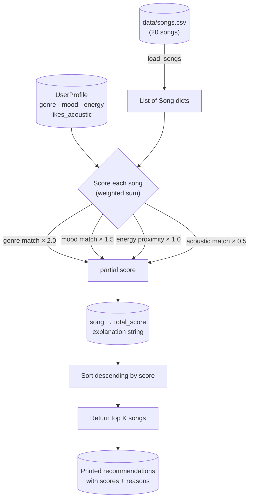

# 🎵 Music Recommender Simulation

## Project Summary

In this project you will build and explain a small music recommender system.

Your goal is to:

- Represent songs and a user "taste profile" as data
- Design a scoring rule that turns that data into recommendations
- Evaluate what your system gets right and wrong
- Reflect on how this mirrors real world AI recommenders

This simulation builds a **content-based music recommender** that scores every song in a small catalog against a user's taste profile and returns the top matches. It mirrors how Spotify's "taste profile" feature works at a simplified scale — no other users are involved, only song attributes and personal preferences.

---

## How The System Works

### How Real-World Recommenders Work

Streaming platforms like Spotify and YouTube use two complementary strategies:

- **Collaborative filtering** — "People who liked what you liked also loved X." The system finds users with similar listening histories and surfaces songs they enjoyed that you haven't heard yet. It requires large amounts of behavioral data (plays, skips, saves) and works best when many users share overlapping taste.
- **Content-based filtering** — "This song has attributes similar to songs you already love." The system analyzes features of the music itself — genre, tempo, mood, energy — and recommends songs with matching characteristics. It works even for brand-new users with no history.

Real platforms blend both approaches (hybrid filtering), but this simulation implements **content-based filtering only**, using song attributes from `data/songs.csv`.

---

### Features Used

**`Song` object attributes:**

| Feature | Type | What it captures |
|---|---|---|
| `genre` | string | Musical style (pop, lofi, rock, jazz, etc.) |
| `mood` | string | Emotional tone (happy, chill, intense, moody, etc.) |
| `energy` | float 0–1 | How driving/loud/active the track feels |
| `valence` | float 0–1 | Musical positivity (high = upbeat, low = melancholic) |
| `danceability` | float 0–1 | Rhythmic groove and beat regularity |
| `acousticness` | float 0–1 | Amount of acoustic (non-electronic) instrumentation |
| `tempo_bpm` | float | Beats per minute |

**`UserProfile` attributes:**

| Field | What it stores |
|---|---|
| `favorite_genre` | The genre the user gravitates toward most |
| `favorite_mood` | Preferred emotional tone |
| `target_energy` | Desired energy level (0–1) |
| `likes_acoustic` | Whether the user prefers acoustic over electronic sound |

---

### Scoring Rule (one song)

Each song receives a **relevance score** computed as a weighted sum:

```
score = (genre_weight   × genre_match)           # +1 if genre matches, else 0
      + (mood_weight    × mood_match)             # +1 if mood matches, else 0
      + (energy_weight  × energy_proximity)       # 1 - |song.energy - user.target_energy|
      + (acoustic_weight × acoustic_match)        # reward high acousticness if user likes acoustic
```

The **energy proximity** formula `1 - |song.energy - target|` gives a score of 1.0 for a perfect match and decreases continuously as the gap widens — rewarding *closeness*, not just high or low values.

Suggested weights (to be tuned in experiments):

- `genre_weight = 2.0` — genre is the strongest signal of taste
- `mood_weight = 1.5` — mood strongly shapes listening context
- `energy_weight = 1.0` — energy is important but more gradual
- `acoustic_weight = 0.5` — secondary texture preference

---

### Ranking Rule (all songs)

Once every song has a score, the `Recommender` **sorts the full catalog by score descending** and returns the top `k` songs. This separates concerns: scoring answers "how relevant is this one song?" while ranking answers "given all scores, which songs should I show?"

---

### Example User Profile

The starter profile used in `src/main.py` and in tests:

```python
user_prefs = {
    "genre":        "lofi",       # strongly prefers lofi
    "mood":         "chill",      # wants a calm, relaxed vibe
    "target_energy": 0.40,        # low-energy background listening
    "likes_acoustic": True        # prefers natural, warm sound over electronic
}
```

**Why this profile tests differentiation well:** A "chill lofi" fan with low energy and acoustic preference should clearly rank songs like *Library Rain* and *Focus Flow* at the top, while high-energy tracks like *Gym Hero* (pop/intense/0.93) and *Pulse Protocol* (edm/energetic/0.97) should score near the bottom — even if they match on energy direction alone.

---

### Finalized Algorithm Recipe

| Signal | Formula | Weight | Rationale |
|---|---|---|---|
| Genre match | `1 if song.genre == user.genre else 0` | **2.0** | Strongest predictor of taste; mismatches feel jarring |
| Mood match | `1 if song.mood == user.mood else 0` | **1.5** | Shapes listening context (workout vs. study vs. sleep) |
| Energy proximity | `1 - abs(song.energy - user.target_energy)` | **1.0** | Continuous; rewards closeness not extremes |
| Acoustic texture | `song.acousticness if likes_acoustic else (1 - song.acousticness)` | **0.5** | Secondary tonal preference |

**Max possible score: 5.0** (genre + mood + perfect energy + acoustic alignment)

---

### Data Flow Diagram



---

### Expected Biases and Limitations

- **Genre over-prioritization:** With weight 2.0, a genre match alone outweighs a near-perfect mood + energy match. A song that is the perfect vibe but the wrong genre label will rank poorly — even though the user might love it.
- **Filter bubble risk:** If the user's favorite genre has only 2 songs in the catalog, the system may always surface the same 2 tracks regardless of other quality signals. It can't recommend what isn't there.
- **Binary genre matching:** "indie pop" and "pop" are treated as completely different — the system has no concept of genre proximity.
- **`likes_acoustic` is all-or-nothing:** A user who *sometimes* likes acoustic depending on mood gets no nuance; the flag applies uniformly.
- **No temporal context:** The system doesn't know if it's 7 AM (chill) or 11 PM (moody). Real platforms use time-of-day as a signal.

---

## Getting Started

### Setup

1. Create a virtual environment (optional but recommended):

   ```bash
   python -m venv .venv
   source .venv/bin/activate      # Mac or Linux
   .venv\Scripts\activate         # Windows

2. Install dependencies

```bash
pip install -r requirements.txt
```

3. Run the app:

```bash
python -m src.main            # all profiles, balanced mode
python -m src.main --modes    # compare all scoring modes
python -m src.main --diversity  # show diversity re-ranker
```

### Sample Terminal Output

```
Loaded songs: 20

  Profile : chill_lofi_fan  |  Mode : balanced
  Genre   : lofi  Mood : chill  Energy : 0.4  Sub-mood : dreamy  Decade : 2020
  #   Title               Artist          Genre/Mood       Sub-mood    Pop  Era   Score     Top reasons
  --  ------------------  --------------  ---------------  ----------  ---  ----  --------  ----------------------------------------------
  #1  Library Rain        Paper Lanterns  lofi / chill     dreamy      38   2020  6.29/6.6  genre 'lofi' (+2.0) | mood 'chill' (+1.5)
  #2  Midnight Coding     LoRoom          lofi / chill     dreamy      45   2020  6.27/6.6  genre 'lofi' (+2.0) | mood 'chill' (+1.5)
  #3  Focus Flow          LoRoom          lofi / focused   meditative  50   2020  3.84/6.6  genre 'lofi' (+2.0) | energy 0.40→0.40 (+1.00)
  #4  Spacewalk Thoughts  Orbit Bloom     ambient / chill  meditative  29   2010  3.18/6.6  mood 'chill' (+1.5) | energy 0.28→0.40 (+0.88)
  #5  Island Drift        Kaia Blue       reggae / chill   carefree    44   2010  3.04/6.6  mood 'chill' (+1.5) | energy 0.52→0.40 (+0.88)

  Profile : pop_party_goer  |  Mode : balanced
  Genre   : pop  Mood : happy  Energy : 0.85  Sub-mood : euphoric  Decade : 2020
  #   Title                 Artist         Genre/Mood           Sub-mood   Pop  Era   Score     Top reasons
  --  --------------------  -------------  -------------------  ---------  ---  ----  --------  --------------------------------------------------
  #1  Sunrise City          Neon Echo      pop / happy          euphoric   72   2020  6.40/6.6  genre 'pop' (+2.0) | mood 'happy' (+1.5)
  #2  Rooftop Lights        Indigo Parade  indie pop / happy    euphoric   63   2020  4.22/6.6  mood 'happy' (+1.5) | energy 0.76→0.85 (+0.91)
  #3  Gym Hero              Max Pulse      pop / intense        motivated  81   2020  3.94/6.6  genre 'pop' (+2.0) | energy 0.93→0.85 (+0.92)
  #4  Crown Heights Summer  Jay Reels      hip-hop / energetic  euphoric   77   2020  2.99/6.6  energy 0.85→0.85 (+1.00) | electronic 0.08 (+0.46)
  #5  Pulse Protocol        Circuit Null   edm / energetic      motivated  84   2020  1.92/6.6  energy 0.97→0.85 (+0.88) | electronic 0.02 (+0.49)

  Profile : late_night_driver  |  Mode : balanced
  Genre   : synthwave  Mood : moody  Energy : 0.75  Sub-mood : melancholic  Decade : 2020
  #   Title                 Artist       Genre/Mood           Sub-mood     Pop  Era   Score     Top reasons
  --  --------------------  -----------  -------------------  -----------  ---  ----  --------  --------------------------------------------------
  #1  Night Drive Loop      Neon Echo    synthwave / moody    melancholic  55   2020  6.36/6.6  genre 'synthwave' (+2.0) | mood 'moody' (+1.5)
  #2  Neon Sermon           GVRL         electronic / moody   melancholic  52   2020  4.35/6.6  mood 'moody' (+1.5) | energy 0.70→0.75 (+0.95)
  #3  Crown Heights Summer  Jay Reels    hip-hop / energetic  euphoric     77   2020  1.89/6.6  energy 0.85→0.75 (+0.90) | electronic 0.08 (+0.46)
  #4  Broken Compass        Rust & Rope  country / sad        melancholic  27   2000  1.88/6.6  energy 0.30→0.75 (+0.55) | electronic 0.90 (+0.05)
  #5  Sunrise City          Neon Echo    pop / happy          euphoric     72   2020  1.86/6.6  energy 0.82→0.75 (+0.93) | electronic 0.18 (+0.41)

  Profile : high_energy_sad  |  Mode : balanced  (adversarial profile)
  Genre   : classical  Mood : sad  Energy : 0.9  Sub-mood : aggressive  Decade : —
  #   Title           Artist       Genre/Mood            Sub-mood     Pop  Era   Score     Top reasons
  --  --------------  -----------  --------------------  -----------  ---  ----  --------  ---------------------------------------------------
  #1  Storm Runner    Voltline     rock / intense        aggressive   68   2010  2.64/6.6  energy 0.91→0.90 (+0.99) | electronic 0.10 (+0.45)
  #2  Iron Cathedral  Frostwall    metal / angry         aggressive   61   2010  2.60/6.6  energy 0.96→0.90 (+0.94) | electronic 0.05 (+0.47)
  #3  Sonata in Grey  Elena Marsh  classical / peaceful  meditative   22   2010  2.38/6.6  genre 'classical' (+2.0) | energy 0.20→0.90 (+0.30)
  #4  Broken Compass  Rust & Rope  country / sad         melancholic  27   2000  2.03/6.6  mood 'sad' (+1.5) | energy 0.30→0.90 (+0.40)
  #5  Gym Hero        Max Pulse    pop / intense         motivated    81   2020  1.69/6.6  energy 0.93→0.90 (+0.97) | electronic 0.05 (+0.47)
```

### Running Tests

Run the starter tests with:

```bash
pytest
```

You can add more tests in `tests/test_recommender.py`.

---

## Experiments You Tried

### Experiment 1: Weight shift — energy ×2, genre ×0.5

Changed `genre=2.0 → 1.0` and `energy=1.0 → 2.0` using the `--modes` flag
(`energy_focused` mode).

**chill_lofi_fan result:** Top 2 unchanged. Position #3 flipped from *Focus Flow*
(lofi/focused, genre match but mood mismatch) to *Spacewalk Thoughts*
(ambient/chill, no genre match but perfect energy + mood). Energy closeness now
outweighs the genre bonus for the third slot.

**high_energy_sad result (most revealing):** *Sonata in Grey* (classical, energy=0.20)
dropped out of the top 5 entirely. With default weights its genre bonus (2.0) beat
a 0.70-point energy penalty. With energy doubled, the high-energy rock/metal tracks
correctly dominated. The experiment showed the default genre weight was *too strong*
for adversarial profiles.

**Conclusion:** Genre weight makes recommendations feel predictable and on-brand;
energy weight makes them feel sonically accurate. The right balance depends on the
user — a static number can't capture both at once.

### Experiment 2: Scoring modes comparison (`python -m src.main --modes`)

Ran all five modes (balanced, genre_first, mood_first, energy_focused, discovery)
against the `chill_lofi_fan` profile. Key finding:

- `mood_first` bumped *Spacewalk Thoughts* (ambient/chill) past *Focus Flow*
  (lofi/focused) because mood weight 3.0 > genre bonus 1.0 for the third slot.
- `discovery` mode (negative popularity weight) slightly penalised *Focus Flow*
  (pop=50) relative to less-known tracks — a small but measurable shift.
- `genre_first` mode locked the top 3 as all-lofi regardless of mood or energy.

### Experiment 3: Diversity re-ranker (`python -m src.main --diversity`)

Without diversity: `chill_lofi_fan` top 5 included 3 lofi tracks and 2 artists
from LoRoom. With diversity (max 2 per genre, max 2 per artist): *Focus Flow*
was replaced by *Coffee Shop Stories* (jazz), spreading the list across 4 genres.
Scores did not change — only selection did.

---

## Limitations and Risks

- **Genre weight is too dominant for sparse catalogs.** If the user's favorite
  genre has only one song, that song is always #1 even if every other attribute
  mismatches. The `high_energy_sad` (classical) profile surfaced a peaceful,
  slow song as #3 purely on genre label — a clear failure.
- **Filter bubbles from catalog size.** The `perfectly_average` (r&b/romantic)
  profile had its only matching song score 4.84, then the #2 result dropped to
  1.29. There was nothing else to recommend. Diversity of output requires
  diversity of data.
- **Binary genre matching.** "indie pop" and "pop" are treated as unrelated.
  A pop fan who would enjoy *Rooftop Lights* gets no credit for that affinity.
- **No temporal or contextual signals.** The system does not know if it is
  7 AM (study mode) or 11 PM (wind-down). Real platforms use time of day as
  a strong signal.
- **Manually assigned attributes.** Energy, acousticness, and valence values
  were set by hand during design — not derived from real audio analysis.

See `model_card.md` for a deeper breakdown of each limitation.

---

## Reflection

Read and complete `model_card.md`:

[**Model Card**](model_card.md)

The central thing this project taught me is that a recommender doesn't need to
be complex to produce outputs that *feel* personalized — and that this is
precisely what makes simple systems dangerous in production. Four weighted
signals and a sort were enough to make the `chill_lofi_fan` profile look like a
handcrafted Spotify playlist. But the same four signals recommended the softest
song in the catalog to a listener who wanted maximum energy, just because it
shared a genre label. The algorithm was internally consistent the entire time.
"Internally consistent" and "actually correct" are not the same thing, and there
is no formula that can tell you which side of that line you're on — only running
the system against real inputs can do that.

The deeper lesson about bias is that it lives in the *data* as much as in the
*code*. The scoring formula had no explicit preference for any genre, but because
some genres appeared only once in the catalog, those users always received the
same single song no matter how poorly it fit their other preferences. That is a
filter bubble produced entirely by catalog construction, not by any flaw in the
algorithm. In a real platform — where catalog and algorithm are maintained by
different teams — this kind of bias can be invisible for a long time because each
team's piece looks fine in isolation.


