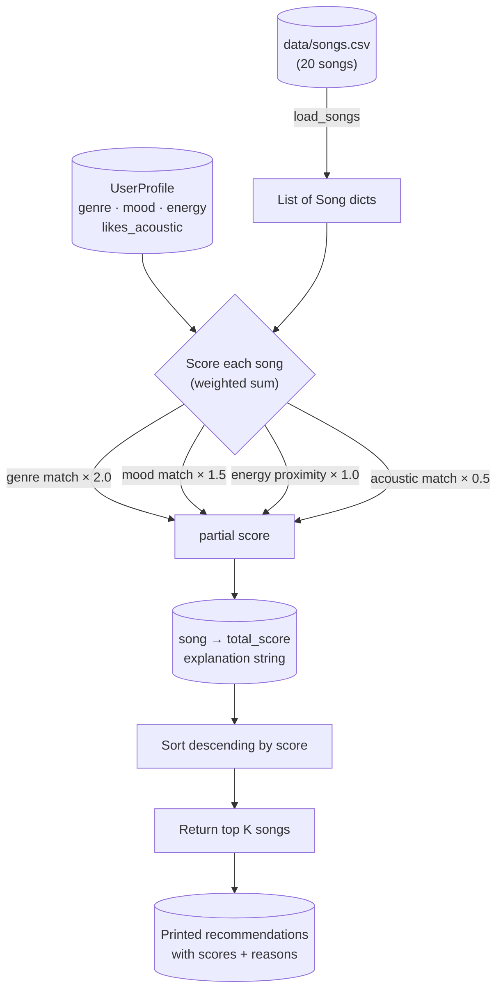

# 🎵 Music Recommender Simulation

## Project Summary

In this project you will build and explain a small music recommender system.

Your goal is to:

- Represent songs and a user "taste profile" as data
- Design a scoring rule that turns that data into recommendations
- Evaluate what your system gets right and wrong
- Reflect on how this mirrors real world AI recommenders

This simulation builds a **content-based music recommender** that scores every song in a small catalog against a user's taste profile and returns the top matches. It mirrors how Spotify's "taste profile" feature works at a simplified scale — no other users are involved, only song attributes and personal preferences.

---

## How The System Works

### How Real-World Recommenders Work

Streaming platforms like Spotify and YouTube use two complementary strategies:

- **Collaborative filtering** — "People who liked what you liked also loved X." The system finds users with similar listening histories and surfaces songs they enjoyed that you haven't heard yet. It requires large amounts of behavioral data (plays, skips, saves) and works best when many users share overlapping taste.
- **Content-based filtering** — "This song has attributes similar to songs you already love." The system analyzes features of the music itself — genre, tempo, mood, energy — and recommends songs with matching characteristics. It works even for brand-new users with no history.

Real platforms blend both approaches (hybrid filtering), but this simulation implements **content-based filtering only**, using song attributes from `data/songs.csv`.

---

### Features Used

**`Song` object attributes:**

| Feature | Type | What it captures |
|---|---|---|
| `genre` | string | Musical style (pop, lofi, rock, jazz, etc.) |
| `mood` | string | Emotional tone (happy, chill, intense, moody, etc.) |
| `energy` | float 0–1 | How driving/loud/active the track feels |
| `valence` | float 0–1 | Musical positivity (high = upbeat, low = melancholic) |
| `danceability` | float 0–1 | Rhythmic groove and beat regularity |
| `acousticness` | float 0–1 | Amount of acoustic (non-electronic) instrumentation |
| `tempo_bpm` | float | Beats per minute |

**`UserProfile` attributes:**

| Field | What it stores |
|---|---|
| `favorite_genre` | The genre the user gravitates toward most |
| `favorite_mood` | Preferred emotional tone |
| `target_energy` | Desired energy level (0–1) |
| `likes_acoustic` | Whether the user prefers acoustic over electronic sound |

---

### Scoring Rule (one song)

Each song receives a **relevance score** computed as a weighted sum:

```
score = (genre_weight   × genre_match)           # +1 if genre matches, else 0
      + (mood_weight    × mood_match)             # +1 if mood matches, else 0
      + (energy_weight  × energy_proximity)       # 1 - |song.energy - user.target_energy|
      + (acoustic_weight × acoustic_match)        # reward high acousticness if user likes acoustic
```

The **energy proximity** formula `1 - |song.energy - target|` gives a score of 1.0 for a perfect match and decreases continuously as the gap widens — rewarding *closeness*, not just high or low values.

Suggested weights (to be tuned in experiments):

- `genre_weight = 2.0` — genre is the strongest signal of taste
- `mood_weight = 1.5` — mood strongly shapes listening context
- `energy_weight = 1.0` — energy is important but more gradual
- `acoustic_weight = 0.5` — secondary texture preference

---

### Ranking Rule (all songs)

Once every song has a score, the `Recommender` **sorts the full catalog by score descending** and returns the top `k` songs. This separates concerns: scoring answers "how relevant is this one song?" while ranking answers "given all scores, which songs should I show?"

---

### Example User Profile

The starter profile used in `src/main.py` and in tests:

```python
user_prefs = {
    "genre":        "lofi",       # strongly prefers lofi
    "mood":         "chill",      # wants a calm, relaxed vibe
    "target_energy": 0.40,        # low-energy background listening
    "likes_acoustic": True        # prefers natural, warm sound over electronic
}
```

**Why this profile tests differentiation well:** A "chill lofi" fan with low energy and acoustic preference should clearly rank songs like *Library Rain* and *Focus Flow* at the top, while high-energy tracks like *Gym Hero* (pop/intense/0.93) and *Pulse Protocol* (edm/energetic/0.97) should score near the bottom — even if they match on energy direction alone.

---

### Finalized Algorithm Recipe

| Signal | Formula | Weight | Rationale |
|---|---|---|---|
| Genre match | `1 if song.genre == user.genre else 0` | **2.0** | Strongest predictor of taste; mismatches feel jarring |
| Mood match | `1 if song.mood == user.mood else 0` | **1.5** | Shapes listening context (workout vs. study vs. sleep) |
| Energy proximity | `1 - abs(song.energy - user.target_energy)` | **1.0** | Continuous; rewards closeness not extremes |
| Acoustic texture | `song.acousticness if likes_acoustic else (1 - song.acousticness)` | **0.5** | Secondary tonal preference |

**Max possible score: 5.0** (genre + mood + perfect energy + acoustic alignment)

---

### Data Flow Diagram



---

### Expected Biases and Limitations

- **Genre over-prioritization:** With weight 2.0, a genre match alone outweighs a near-perfect mood + energy match. A song that is the perfect vibe but the wrong genre label will rank poorly — even though the user might love it.
- **Filter bubble risk:** If the user's favorite genre has only 2 songs in the catalog, the system may always surface the same 2 tracks regardless of other quality signals. It can't recommend what isn't there.
- **Binary genre matching:** "indie pop" and "pop" are treated as completely different — the system has no concept of genre proximity.
- **`likes_acoustic` is all-or-nothing:** A user who *sometimes* likes acoustic depending on mood gets no nuance; the flag applies uniformly.
- **No temporal context:** The system doesn't know if it's 7 AM (chill) or 11 PM (moody). Real platforms use time-of-day as a signal.

---

## Getting Started

### Setup

1. Create a virtual environment (optional but recommended):

   ```bash
   python -m venv .venv
   source .venv/bin/activate      # Mac or Linux
   .venv\Scripts\activate         # Windows

2. Install dependencies

```bash
pip install -r requirements.txt
```

3. Run the app:

```bash
python -m src.main
```

### Running Tests

Run the starter tests with:

```bash
pytest
```

You can add more tests in `tests/test_recommender.py`.

---

## Experiments You Tried

Use this section to document the experiments you ran. For example:

- What happened when you changed the weight on genre from 2.0 to 0.5
- What happened when you added tempo or valence to the score
- How did your system behave for different types of users

---

## Limitations and Risks

Summarize some limitations of your recommender.

Examples:

- It only works on a tiny catalog
- It does not understand lyrics or language
- It might over favor one genre or mood

You will go deeper on this in your model card.

---

## Reflection

Read and complete `model_card.md`:

[**Model Card**](model_card.md)

The central thing this project taught me is that a recommender doesn't need to
be complex to produce outputs that *feel* personalized — and that this is
precisely what makes simple systems dangerous in production. Four weighted
signals and a sort were enough to make the `chill_lofi_fan` profile look like a
handcrafted Spotify playlist. But the same four signals recommended the softest
song in the catalog to a listener who wanted maximum energy, just because it
shared a genre label. The algorithm was internally consistent the entire time.
"Internally consistent" and "actually correct" are not the same thing, and there
is no formula that can tell you which side of that line you're on — only running
the system against real inputs can do that.

The deeper lesson about bias is that it lives in the *data* as much as in the
*code*. The scoring formula had no explicit preference for any genre, but because
some genres appeared only once in the catalog, those users always received the
same single song no matter how poorly it fit their other preferences. That is a
filter bubble produced entirely by catalog construction, not by any flaw in the
algorithm. In a real platform — where catalog and algorithm are maintained by
different teams — this kind of bias can be invisible for a long time because each
team's piece looks fine in isolation.


---

## 7. `model_card_template.md`

Combines reflection and model card framing from the Module 3 guidance. :contentReference[oaicite:2]{index=2}  

```markdown
# 🎧 Model Card - Music Recommender Simulation

## 1. Model Name

Give your recommender a name, for example:

> VibeFinder 1.0

---

## 2. Intended Use

- What is this system trying to do
- Who is it for

Example:

> This model suggests 3 to 5 songs from a small catalog based on a user's preferred genre, mood, and energy level. It is for classroom exploration only, not for real users.

---

## 3. How It Works (Short Explanation)

Describe your scoring logic in plain language.

- What features of each song does it consider
- What information about the user does it use
- How does it turn those into a number

Try to avoid code in this section, treat it like an explanation to a non programmer.

---

## 4. Data

Describe your dataset.

- How many songs are in `data/songs.csv`
- Did you add or remove any songs
- What kinds of genres or moods are represented
- Whose taste does this data mostly reflect

---

## 5. Strengths

Where does your recommender work well

You can think about:
- Situations where the top results "felt right"
- Particular user profiles it served well
- Simplicity or transparency benefits

---

## 6. Limitations and Bias

Where does your recommender struggle

Some prompts:
- Does it ignore some genres or moods
- Does it treat all users as if they have the same taste shape
- Is it biased toward high energy or one genre by default
- How could this be unfair if used in a real product

---

## 7. Evaluation

How did you check your system

Examples:
- You tried multiple user profiles and wrote down whether the results matched your expectations
- You compared your simulation to what a real app like Spotify or YouTube tends to recommend
- You wrote tests for your scoring logic

You do not need a numeric metric, but if you used one, explain what it measures.

---

## 8. Future Work

If you had more time, how would you improve this recommender

Examples:

- Add support for multiple users and "group vibe" recommendations
- Balance diversity of songs instead of always picking the closest match
- Use more features, like tempo ranges or lyric themes

---

## 9. Personal Reflection

A few sentences about what you learned:

- What surprised you about how your system behaved
- How did building this change how you think about real music recommenders
- Where do you think human judgment still matters, even if the model seems "smart"

